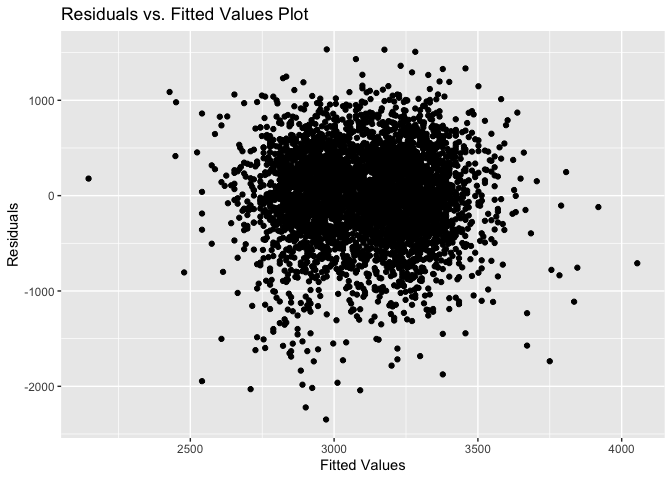
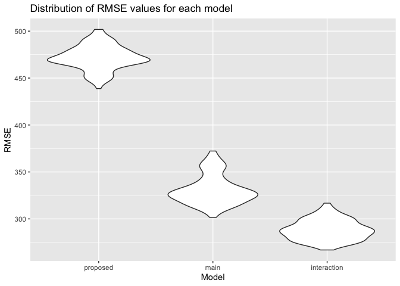

p8105\_hw6\_sl4658
================
Simin Ling
12/3/2020

## Problem 1

Create a city\_state variable and a binary variable indicating whether
the homicide is solved.

``` r
homicide_df = 
  read_csv("./data/homicide-data.csv", na = c("", "NA", "Unknown")) %>% 
  mutate(
    city_state = str_c(city, state, sep = ", "),
    victim_age = as.numeric(victim_age),
    victim_race = as.factor(victim_race),
    victim_sex = as.factor(victim_sex),
    resolved = case_when(
      disposition  == "Closed without arrest" ~ 0,
      disposition  == "Open/No arrest" ~ 0,
      disposition  == "Closed by arrest" ~ 1)
  ) %>% 
  filter(
    city_state != "Tulsa, AL",
    victim_race %in% c("White", "Black")
    ) %>% 
  select(city_state, resolved, victim_age, victim_race, victim_sex)
```

Create a dataframe for Baltimore, MD

``` r
baltimore_df = 
  homicide_df %>%
  filter(city_state == "Baltimore, MD")

head(baltimore_df)
```

    ## # A tibble: 6 x 5
    ##   city_state    resolved victim_age victim_race victim_sex
    ##   <chr>            <dbl>      <dbl> <fct>       <fct>     
    ## 1 Baltimore, MD        0         17 Black       Male      
    ## 2 Baltimore, MD        0         26 Black       Male      
    ## 3 Baltimore, MD        0         21 Black       Male      
    ## 4 Baltimore, MD        1         61 White       Male      
    ## 5 Baltimore, MD        1         46 Black       Male      
    ## 6 Baltimore, MD        1         27 Black       Male

Fit the logistic regression for Baltimore, MD

``` r
glm(resolved ~ victim_age + victim_race + victim_sex, 
    data = baltimore_df,
    family = binomial()) %>%
  broom::tidy() %>%
  mutate(
    OR = exp(estimate),
    CI_lower = exp(estimate - 1.96 * std.error),
    CI_upper = exp(estimate + 1.96 * std.error)
  ) %>%
  select(term, OR, starts_with("CI")) %>% 
  knitr::kable(digits = 3)
```

| term              |    OR | CI\_lower | CI\_upper |
| :---------------- | ----: | --------: | --------: |
| (Intercept)       | 1.363 |     0.975 |     1.907 |
| victim\_age       | 0.993 |     0.987 |     1.000 |
| victim\_raceWhite | 2.320 |     1.648 |     3.268 |
| victim\_sexMale   | 0.426 |     0.325 |     0.558 |

Run glm for each of the cities in dataset

``` r
models_results_df = 
  homicide_df %>%
  nest(data = -city_state) %>% 
  mutate(
    models = 
      map(.x = data, ~glm(resolved ~ victim_age + victim_race + victim_sex, data = .x, family = binomial())), 
    results = map(models, broom::tidy)
  ) %>% 
  select(city_state, results) %>% 
  unnest(results) %>% 
  mutate(
    OR = exp(estimate),
    CI_lower = exp(estimate - 1.96 * std.error),
    CI_upper = exp(estimate + 1.96 * std.error)
  ) %>% 
  select(city_state, term, OR, starts_with("CI"))
```

Create a plot that shows the estimated ORs and CIs for each city.

``` r
models_results_df %>% 
  filter(term == "victim_sexMale") %>% 
  mutate(city_state = fct_reorder(city_state, OR)) %>% 
  ggplot(aes(x = city_state, y = OR)) +
  geom_point() +
  geom_errorbar(aes(ymin = CI_lower, ymax = CI_upper)) +
  theme(axis.text.x = element_text(angle = 90, hjust = 1))
```

<!-- -->

As shown in the plot, the estimated ORs of solving homicides comparing
Black victims to White victims for most cities were relatively close and
were smaller than 1, except that Fresno, CA and Stockton, CA had
slightly higher ORs (between 1 and 1.5), and Albuquerque, NM had the
highest OR (between 1.5 and 2). These three cities also had the largest
range of confidence interval, indicating greater uncertainty.

We can conclude that the odds of solving homicides with Black victims
was smaller than the odds of solving homicides with White victims in
most cities in the U.S..

## Problem 2

Load data and check for data types and any missing values

``` r
birthweight_df = 
  read_csv("./data/birthweight.csv", na = c("", "NA", "Unknown"))
```

    ## Parsed with column specification:
    ## cols(
    ##   .default = col_double()
    ## )

    ## See spec(...) for full column specifications.

``` r
head(birthweight_df)
```

    ## # A tibble: 6 x 20
    ##   babysex bhead blength   bwt delwt fincome frace gaweeks malform menarche
    ##     <dbl> <dbl>   <dbl> <dbl> <dbl>   <dbl> <dbl>   <dbl>   <dbl>    <dbl>
    ## 1       2    34      51  3629   177      35     1    39.9       0       13
    ## 2       1    34      48  3062   156      65     2    25.9       0       14
    ## 3       2    36      50  3345   148      85     1    39.9       0       12
    ## 4       1    34      52  3062   157      55     1    40         0       14
    ## 5       2    34      52  3374   156       5     1    41.6       0       13
    ## 6       1    33      52  3374   129      55     1    40.7       0       12
    ## # … with 10 more variables: mheight <dbl>, momage <dbl>, mrace <dbl>,
    ## #   parity <dbl>, pnumlbw <dbl>, pnumsga <dbl>, ppbmi <dbl>, ppwt <dbl>,
    ## #   smoken <dbl>, wtgain <dbl>

``` r
any(is.na(birthweight_df)) 
```

    ## [1] FALSE

There is no missing data in this dataset.

Clean data for regression analysis (ensure proper data types)

``` r
birthweight_df = 
  birthweight_df %>%
  mutate(
    babysex = as.factor(babysex),
    frace = as.factor(frace),
    malform = as.factor(malform),
    mrace = as.factor(mrace)
  )
```

Propose a regression model for birthweight (based on a hypothesized
structure for the factors that underly birthweight).

``` r
# Based on my own prediction, I would love to study birthweight as an outcome that may depend on baby sex, father's and mother's race, and mother's weight gain during pregnancy.

proposed_model = 
  lm(bwt ~ babysex + mrace + frace + wtgain, data = birthweight_df)
```

Create a plot of model residuals against fitted values

``` r
residuals_fitted_plot = 
  birthweight_df %>% 
  add_predictions(proposed_model) %>% 
  add_residuals(proposed_model) %>% 
  ggplot(aes(x = pred, y = resid)) +
  geom_point() +
  labs(
    x = "Fitted Values",
    y = "Residuals",
    title = "Residuals vs. Fitted Values Plot"
  )

residuals_fitted_plot
```

<!-- -->

According to the residual plot, the residuals are evenly distributed
across fitted values, so we can conclude that the regression model
follows homoscedasticity.

Compare the proposed model to two others

``` r
# One using length at birth and gestational age as predictors (main effects only)

# One using head circumference, length, sex, and all interactions (including the three-way interaction) between these

cv_df = 
  crossv_mc(birthweight_df, 100) %>%
  mutate(
    proposed_mod = map(train, ~lm(bwt ~ babysex + mrace + frace + wtgain, data = birthweight_df)),
    main_mod = map(train, ~lm(bwt ~ blength + gaweeks, data = birthweight_df)),
    interaction_mod = map(train, ~lm(bwt ~ bhead + blength + babysex + bhead*blength + blength*babysex + bhead*babysex + bhead*blength*babysex, data = .x))
  ) %>%
  mutate(
    rmse_proposed = map2_dbl(proposed_mod, test, ~rmse(model = .x, data = .y)),
    rmse_main = map2_dbl(main_mod, test, ~rmse(model = .x, data = .y)),
    rmse_interaction = map2_dbl(interaction_mod, test, ~rmse(model = .x, data = .y))
  )
```

Create plots to show the distribution of RMSE values for each model

``` r
cv_df %>%
 select(starts_with("rmse")) %>% 
  pivot_longer(
    everything(),
    names_to = "model",
    values_to = "rmse",
    names_prefix = "rmse_"
  ) %>% 
  mutate(model = fct_inorder(model)) %>% 
  ggplot(aes(x = model, y = rmse)) + 
  geom_violin() +
  labs(
    x = "Model",
    y = "RMSE",
    title = "Distribution of RMSE values for each model")
```

<!-- -->

According to the plot, the RMSE value for proposed model is the highest,
followed by the main effects model and then the interaction model. This
indicates that the interaction model is the best fit model for the
dataset among all three models.
